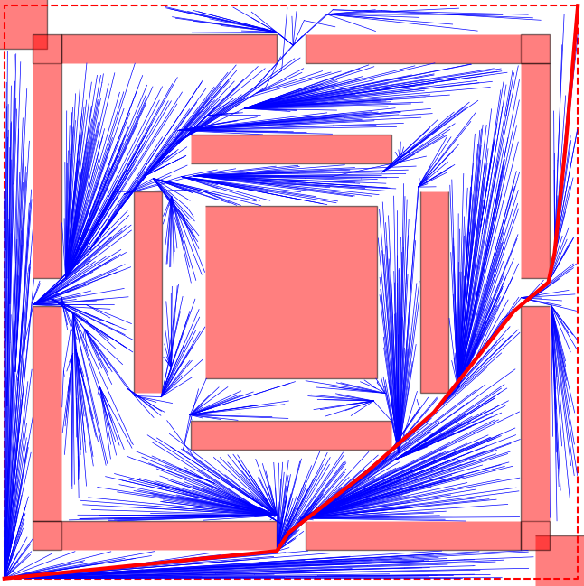
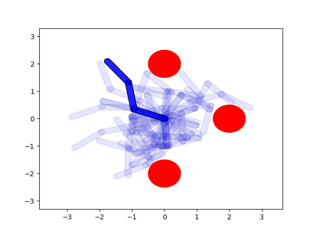

- [What is this library about](#intro)
- [Content](#content)
- [Documentation](#documentation)
- [Usage](#usage)
- [Samples](#samples)
- [CMake support](#cmake-support)




## INTRO

**Multi Thread Rapidly Random exploring Trees**, aka **MT-RRT**, is a C++ library that can be used for path or trajectory planning, implementing different multi-threaded versions of the well known **Rapidly Random exploring Trees**, aka **RRT** algorithm. Inded, **RRT** are a popular cathegory of robotic algorithms used for computing paths or trajectories in a constrained environment.
The multi-threaded strategies contained in this library are able to significantly speed up the normal **RRT**, **bidirectional  RRT** and **RRT***.

This work is based on the results published in this **IROS** paper:
Andrea Casalino et al. :"Mt-rrt: a general purpose multithreading library for path planning", In IEEE/RSJ International Conference on Intelligent Robots and Systems (IROS 2019), pages 1510–1517. IEEE, 2019

This library was conceived to solve any kind of planning problem. The only thing you need to do when solving a new kind of problem, is to derive a couple of objects that contain all the
problem-specific information, refer to the [documentation](./doc/MT-RRT.pdf) and the [samples](#samples). 

**MT-RRT** is completely **cross platform**, let [CMake](#cmake-support) do all the work for you, and has no thirdy party dependency.

If you have found this library useful, please find the time to leave a **star** :).

## CONTENT

This repository contains:
  - [documentation](./doc/MT-RRT.pdf): pdf discussing generalities about **RRT** together with info explaining how to use this library
  - [src](./src/): the sources containing the main features offered by this library. In particular:
    - [src/core](./src/core/): containing **MT-RRT-core**, that provides background functionalities and the classical mon-thread implementation of the **RRT** algorithm.
    - [src/core](./src/core/): containing **MT-RRT-multi-threaded**, that stores the multithreaded **RRT** planners characterizing this library
  - [samples](./samples/): containing 3 classes of examples, explaining how to consume and use this library. Have a look also [here](#samples).

## DOCUMENTATION

It is strongly encouraged to start from the [documentation](doc/MT-RRT.pdf).
This one provides a general background on the **RRT** algorithms and terminology in general and at the same time explains how to use and what to expect from the **RRT** planners implemented in this library.

## USAGE

Haven't already left a **star**? Do it now ;)!

These are the steps to follow in order to solve any planning problem (refer also to this [ReadMe.md](./samples/ReadMe.md)):
- explain to **MT-RRT** how the problem you want to solve is made. In order to do this you need to:
  - define your own **mt_rrt::Sampler**, i.e. an object having the responsability to sample random states (some default ones, which are ok for 99% of the cases, are already provided by this library). Let's say your sampler is named **MySampler**:
  ```cpp
  mt_rrt::SamplerPtr my_sampler = std::make_unique<MySampler>(...);
  ```
  - define your own **mt_rrt::Conenctor**, i.e. an object having the responsability to compute trajectories that connects pair of states.
  In [samples](./samples/), three classes of examples were implemented in order to show you how to do this for your own problem. Let's say your connector is named **MyConnector**:
  ```cpp
  mt_rrt::ConnectorPtr my_connector = std::make_unique<MyConnector>(...);
  ```
- groups all the problem specific information into a special structure named **mt_rrt::ProblemDescription**:
  ```cpp
	mt_rrt::ProblemDescription problem_description;
	problem_description.connector = std::move(my_connector);
	problem_description.sampler = std::move(my_sampler);
  // and a couple of more ... see the samples
  ```
- build a planner. The planner will absorb all the problem specific information. YOu can opt for a standard mono-threaded planner:
```cpp
mt_rrt::StandardPlanner planner(std::move(problem_description));
```
or o multi threaded one, prescribing to use for example 4 threads:
```cpp
mt_rrt::MultiAgentPlanner multi_agent_planner(std::move(problem_description));
multi_agent_planner.setThreads(4);
```
The set of multi threaded planners offered by this library is extensively discussed in the [documentation](./doc/MT-RRT.pdf).
- now you are able to solve the first planning problem, using the **mt_rrt::Parameters** you prefer:
```cpp
mt_rrt::State start_state = ...;
mt_rrt::State end_state = ...;

// define the parameters
mt_rrt::Parameters parameters;
parameters.iterations.set(1500); // number of maximum iterations
parameters.expansion_strategy = mt_rrt::ExpansionStrategy::Star; // set the strategy, see Section "Background on RRT" of the documentation
// ... and some others

// try to solve the problem
mt_rrt::PlannerSolution solution = planner.solve(start_state, end_state, parameters);
std::vector<mt_rrt::State> found_sequence = solution.solution.value(); // access the found solution (is nullopt if no solution was found)
auto time = solution.time; // access the time spent by the planner to find a solution
// ... you can access in that structure also some other info
```
- inspect solution by:
  - checking the found sequence of states, representing the found solution
  - checking the obtained explored trees (yes, they are returned and you can inspect them if you want)
-many problems of the same kind can be solved by keep using (one at a time) the same intialized planner:
```cpp
// solve another problem ... you don't need to build a new planner if the problem is of the same kind.
// Indeed, you can re-use the same planner, but passing the info of this other particular problem to solve
// IMPORTANT !! Clearly, in order to avoid data race, you can solve only 1 problem at a time per planner
mt_rrt::State start_state = ...;
mt_rrt::State end_state = ...;
mt_rrt::Parameters parameters = ...;
mt_rrt::PlannerSolution solution = planner.solve(start_state, end_state, parameters);
```

## SAMPLES

Haven't already left a **star**? Do it now ;)!

Tree classes of samples are contained in [./samples](./samples/). Such samples represent sample planning problems and aims at showing how to use **MT-RRT** in order to solve them.
The [documentation](doc/MT-RRT.pdf) extensively describes the samples and it is strongly encouraged also to have a look to [ReadMe.md](./samples/ReadMe.md) and  [ReadMe.cpp](./samples/ReadMe.cpp) in the samples folder before dive into the samples implementations.
In particular:
	- [./samples/TrivialProblems](./samples/TrivialProblems) represents a 2D maze problem
	- [./samples/PlanarRobotsProblems](./samples/PlanarRobotsProblems) represents a planar robots planning problem
	- [./samples/NavigationProblems](./samples/NavigationProblems) represents a 2D moving cart problem

## CMAKE SUPPORT

Haven't already left a **star**? Do it now ;)!
   
To consume this library you can rely on [CMake](https://cmake.org).
More precisely, You can fetch this package and link to the core library **MT-RRT-multi-threaded**:
```cmake
include(FetchContent)
FetchContent_Declare(
mt_rrt_multi_threaded
GIT_REPOSITORY https://github.com/andreacasalino/MT-RRT
GIT_TAG        master
)
FetchContent_MakeAvailable(mt_rrt_multi_threaded)
```

and then link to the **MT-RRT-multi-threaded** library:
```cmake
target_link_libraries(${TARGET_NAME} MT-RRT-multi-threaded
)
```

If you are only interested in the **MT-RRT-core** you can fecth as done before and link to this one:
```cmake
target_link_libraries(${TARGET_NAME} MT-RRT-core
)
```

**MT-RRT** internally makes use of [omp](https://en.wikipedia.org/wiki/OpenMP), which should be natively supported by any kind of modern compiler. **CMake** will automatically look for the latest **omp** version installed and in case nothing is found an error will occour.

Sometimes is is usefull to check the progress of the solver, printing on the console the iterations done so far. This is not the default behaviour of **MT-RRT** but can be enabled turning to **ON** the **CMake** option called **MT_RRT_SHOW_PLANNER_PROGRESS**. This of course will affects the performance and should be done only for debugging purposes.
